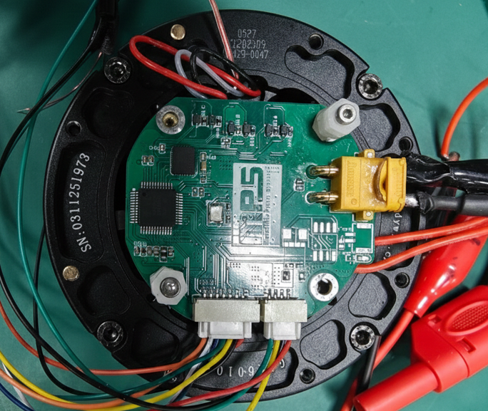
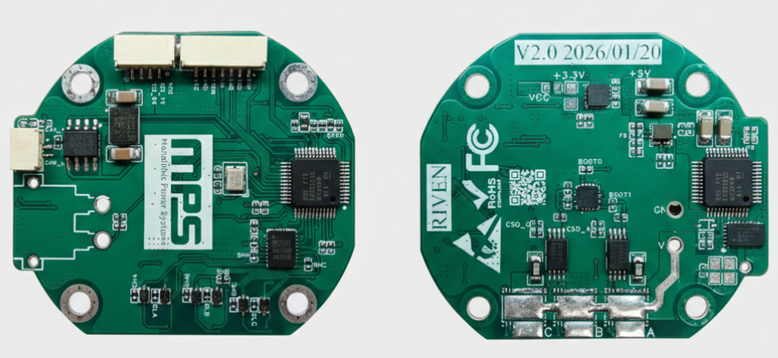

# MPS-FOC 开源电机驱动

<div align="center">

[](LICENSE)
[](https://www.ti.com/product/TMS320F280025C)
[]()
[]()

**基于 TI C2000 F28002x 的三环 FOC 电机驱动**

</div>

## 📋 项目简介

本项目依托于 2025 MPS“智驱未来”机器人芯动力设计挑战赛 并使用MPS旗下系列IC制作电源、驱动和传感器，使用 TI TMS320F280023C 单片机的开源 FOC（磁场定向控制）电机驱动项目。支持有传感器（磁编码器）FOC 闭环控制，提供电流环、速度环、位置环三环级联控制。

目前借助开环电压模式已实现 **速度环** 和 **位置环** 的运行，经验证控制效果良好。在硬件设计上，有预留好供 **电流环** 使用的A、C相电流采样，代码中同样给出了参数整定方法与完整架构。不过若只想复现该项目测试视频中的效果，可以将其电流环删去，简要复现。

### 🔑 核心特性

- **FOC 算法**： Clarke/Park 变换 + SVPWM（带3次谐波注入）
- **三环控制**：电流环(20kHz) → 速度环(2kHz) → 位置环(1kHz)
- **位置传感器**：MA600 磁编码器（13-bit分辨率，4096 PPR）
- **功率驱动**：MP6539 三相 MOSFET 预驱动
- **接口丰富**：支持 UART 调试（可扩展 CAN/RS485）

---

## 🏗️ 硬件说明

### 📦 硬件实物图





### 📦 主要器件

| 器件 | 型号 | 说明 |
|------|------|------|
| MCU | TMS320F280023C | 32-bit C2000，100MHz 主频 |
| 驱动IC | MP6539 | 三相无刷电机预驱动 |
| 编码器 | MA600A | 磁编码器，13-bit 分辨率 |
| 功率MOS | BSC030N08NS5 | 低导通电阻 N-MOS |

### 🔌 引脚定义

```
PWM 输出:  EPWM1A (GPIO0) → A相
           EPWM2A (GPIO2) → B相
           EPWM3A (GPIO4) → C相

电流采样:  ADCINA11 (Ia)
           ADCINB7 (Ic)
           ADCINA5 (Vbus)

MA600A编码器:   GPIO33 (CS)
               GPIO32 (CLK)
               GPIO24 (MOSI)
               GPIO16 (MISO)

控制信号:  GPIO31 (nSLEEP)
           GPIO12 (FAULT)
```

### 📐 电气参数

| 参数 | 数值 |
|------|------|
| 输入电压 | 48V±5% DC |
| 峰值电流 | 4A |
| 持续电流 | 1.5A |
| PWM 频率 | 20kHz |
| 最大转速 | 4000 RPM |

---

## 📂 目录结构

```
mps-foc-opensource/
├── program/                    # 固件源码
│   ├── foc_main.c              # 主程序 + 中断控制
│   ├── app/
│   │   ├── foc_core.c/h        # FOC 核心算法
│   │   ├── soft_spi_ma600.c/h # 磁编码器软SPI驱动
│   │   └── bsp_tim.c/h        # 定时器驱动
│   ├── device/                 # TI C2000 器件库
│   ├── cmd/                    # 链接器配置文件
│   └── c2000.syscfg           # TI SysConfig 配置
├── circuit/                    # 硬件设计
│   ├── PCB_MPS-FOC_V2.1.pdf   # PCB 丝印图
│   └── SCH_MPS-FOC_V2.1.pdf  # 原理图
├── manufacture/                # 制造文件 (Gerber)
│   └── MPS-FOC_V2.1/          # 嘉立创可直接下单
├── LICENSE                     # 许可证文件
└── README.md                   # 本文件
```

---

## 💻 软件说明

### 🌀 三环控制逻辑

| 环 | 频率 | 输入 | 输出 | 作用 |
|----|------|------|------|------|
| 电流环 | 20kHz | Id/Iq 误差 | Vd/Vq | 快速响应，抑制电流波动 |
| 速度环 | 2kHz | 速度误差 | Iq_Ref | 稳态精度，动态响应 |
| 位置环 | 1kHz | 位置误差 | Speed_Ref | 位置跟踪，高精度控制 |

### ⚙️ 参数配置

在 `foc_main.c` 中修改以下参数：

#### 1. 电机参数

```c
// 电机参数
#define POLE_PAIRS      14      // 极对数
#define PWM_PERIOD      2500    // PWM周期 (20kHz @ 50MHz)
#define GEAR_RATIO      8.0f    // 减速比
```

#### 2. 电流环参数 (根据带宽计算)

电流环使用 PI 控制器，参数可根据 desired bandwidth 自动计算：

```c
// 电机参数
float control_freq = 20000;              // 控制频率 20kHz
float singlephase_R = 1.45f/2.0f;       // 单相电阻 (Ω)
float singlephase_L = 0.823f/2.0f/1000; // 单相电感 (H)

// 电流环带宽 (建议设为采样频率的1/10~1/20，即 1kHz~2kHz)
float current_bandwidth = 1000.0f;       // 电流环带宽 (Hz)

// PI 参数计算公式:
// Ti = L/R (积分时间常数)
// Kp = L * ωc (比例增益)
// Ki = R * ωc (积分增益)
// 其中 ωc = 2π * fc (交叉频率)
float current_Ti = singlephase_L / singlephase_R;       // 积分时间
float current_wc = 2.0f * 3.14159f * current_bandwidth; // 交叉频率
float current_Kp = singlephase_L * current_wc;          // 比例增益
float current_Ki = singlephase_R * current_wc;          // 积分增益
```

#### 3. 速度环/位置环参数

```c
// 速度环 (2kHz)
pid_spd.Kp = 0.1f; pid_spd.Ki = 0.005f; pid_spd.OutMax = VOLTAGE_LIMIT;

// 位置环 (1kHz)
pid_pos.Kp = 20.0f; pid_pos.Ki = 0.0f; pid_pos.OutMax = 500.0f;
```

> **提示**: 调整 `current_bandwidth` 可改变电流环响应速度。带宽越高，响应越快，但对噪声越敏感。

---

## 🚀 快速开始

### 🛠️ 开发环境

- **IDE**: TI CCS (Code Composer Studio) 12.x
- **SDK**: C2000Ware 6.00.01+
- **编译器**: TI C2000 Clang v3.x


### 🔌 硬件连接


```
┌─────────────────┐         ┌─────────────────┐
│   FOC 驱动板    │         │    电机模组     │
│                 │         │                 │
│  A+  ───────────┼─────────▶│   A相 (橙)     │
│  B+  ───────────┼─────────▶│   B相 (黄)     │
│  C+  ───────────┼─────────▶│   C相 (绿)     │
│  GND ──────────┼─────────▶│   GND (黑)     │
│                 │         │                 │
└─────────────────┘         └─────────────────┘
```

### 🎮 运行步骤

1. **上电初始化**
   - 系统自动进行电流零点校准（1秒）
   - 校准完成后进入编码器对齐阶段（1秒）
   - 对齐完成后进入闭环控制

2. **选择控制模式**

   | 模式 | Control_Mode 值 | 说明 |
   |------|-----------------|------|
   | 力矩模式 | 0 | 直接给定电压 |
   | 速度模式 | 1 | 给定目标转速 |
   | 位置模式 | 2 | 给定目标角度 |

3. **调试接口**

   通过 CCS 调试窗口修改变量：

   ```c
   Run_Flag = 1;           // 启动 PWM 输出
   Control_Mode = 1;       // 切换到速度模式
   User_Speed_Ref = 500;  // 设置目标转速 500 RPM
   ```

### 🔧 调试步骤（快速检查表）

| 步骤 | 内容 | 验证方法 |
|:---:|------|----------|
| 1 | **硬件检查** | 测 3.3V / 12V / 48V / LED正常亮起 |
| 2 | **程序烧录** | 检查ADC中断，定时器中断能否正常运行 |
| 3 | **PWM 测试** | 示波器查看三相 PWM + 死区时间 |
| 4 | **ADC 校准** | 断开电流，零点应在 2048 附近 |
| 5 | **编码器** | 旋转电机，观察角度变化 |
| 6 | **开环电压模式** | `Control_Mode=0`，`User_Iq_Ref=1` 电机转动|
| 7 | **速度环** | `Control_Mode=1`，`User_Speed_Ref=100` |
| 8 | **位置环** | `Control_Mode=2`，`User_Pos_Ref=3.14` |

### 调试变量速查

```c
Run_Flag = 1;           // 1=开启PWM, 0=关闭
Control_Mode = 0;       // 0=电压/1=速度/2=位置
User_Iq_Ref = 1.0f;    // 电压模式输入 (V)
User_Speed_Ref = 100;   // 速度模式输入 (RPM)
User_Pos_Ref = 3.14;   // 位置模式输入 (Rad)
MA600_dir = 1.0f;      // 编码器方向，取反改 -1
```

### 常见问题

| 问题 | 解决方法 |
|------|----------|
| 电机不转/异响 | 交换 A/B/C 相序 |
| 只朝一个方向转 | `MA600_dir = -1` |
| 电流采样异常 | 检查运放偏置、调整 `CURRENT_SCALE` |
| 速度波动大 | 调小 `Speed_Filter_K` 或调整 PID |

---

## 📖 使用教程

### 电机参数整定

1. **电流环参数整定(暂无)**
   - 测试阶段用较小初值尝试
   - 测试完成后，用计算公式整定


2. **速度环参数整定**
   - 电流环稳定后，切换到速度模式
   - 给定小目标速度（如 100 RPM）
   - 整定方法同上
   - 推荐初值：Kp=0.1, Ki=0.005

3. **位置环参数整定**
   - 最后整定位置环，仅用Kp


### 🔧 常见问题

**Q1: 电机不转，有异响**

> 检查：
> 1. 尝试更换A,B,C三相相序任意两根
> 2. 尝试修改编码器极性
> 3. PWM 输出是否正常


---

## 📄 许可证

本项目采用 [CERN-OHL-S v2](LICENSE) 开源许可证。

CERN-OHL-S 是硬件开源的标准许可证，要求衍生作品必须以相同条款开源。

---


## 📧 联系我们

- 问题反馈：GitHub Issues
- 邮箱：banzang_coder@163.com

---

<div align="center">

</div>
